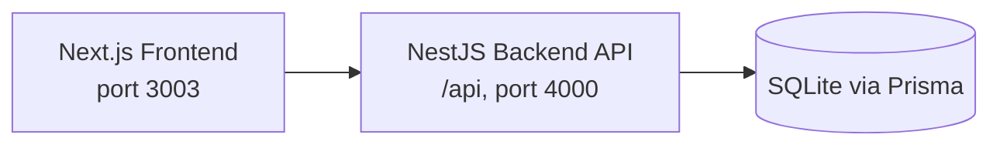

<div align="center">
  <h1>MeBase</h1>
  <p><strong>A private, local-first Life OS for finance, health, and daily planning.</strong></p>
  <p>
    
    
    
    
    
  </p>
</div>

> MeBase helps you run your personal operations system in one place, while keeping your data under your own control.

## Table of Contents

- [Why This Project](#why-this-project)
- [About the App](#about-the-app)
- [Key Features](#key-features)
- [Architecture](#architecture)
- [Tech Stack](#tech-stack)
- [Quick Start (Development)](#quick-start-development)
- [Environment Variables](#environment-variables)
- [Production Deployment (Docker)](#production-deployment-docker)
- [NPM Scripts](#npm-scripts)
- [Repository Structure](#repository-structure)
- [Privacy and Security](#privacy-and-security)
- [Contributing](#contributing)
- [Roadmap](#roadmap)
- [License](#license)

## Why This Project

Many personal productivity and tracking tools are cloud-only and subscription-based. MeBase follows a different approach:

- your data remains local,
- no telemetry as default behavior,
- one integrated system for finance, health, and personal planning.

## About the App

MeBase is a modular dashboard designed to centralize personal management workflows that are usually scattered across multiple apps.

At its core, it combines:

- personal finance operations,
- health and habit tracking,
- garage and asset records,
- practical analytics for everyday decision making.

The primary goal is simple: provide clarity and control without forcing users into cloud lock-in.

## Key Features

### Finance

- expense and income tracking,
- categories, limits, and monthly summaries,
- recurring payments and subscriptions,
- analytics and data import workflows.

### Health and Productivity

- daily health logs,
- workout and nutrition entries,
- energy and habit tracking,
- work time planning.

### Garage and Assets

- history of vehicle-related costs and events,
- operating expense tracking,
- centralized key records and documents.

## Architecture

The project has two application layers and one data layer:



- frontend: Next.js (App Router), UI and client-side logic,
- backend: NestJS API with a modular structure,
- database: SQLite + Prisma.

## Tech Stack

- Next.js 16 (React 19)
- NestJS 11
- TypeScript 5
- Tailwind CSS 4
- Prisma 7
- SQLite (better-sqlite3)
- NextAuth
- Docker / Docker Compose

## Quick Start (Development)

### 1. Requirements

- Node.js 20+
- npm 10+

### 2. Clone

```bash
git clone https://github.com/Vesse00/local-finance-dashboard.git
cd local-finance-dashboard
```

### 3. Install dependencies

```bash
npm install
npm install --prefix backend
```

### 4. Configure .env

Create a `.env` file in the project root and set at least:

```env
DATABASE_URL=file:./dev.db
NEXTAUTH_URL=http://localhost:3003
NEXTAUTH_SECRET=replace_with_a_long_random_secret
BACKEND_URL=http://localhost:4000/api
CORS_ORIGIN=http://localhost:3003
INTERNAL_API_SECRET=replace_with_a_different_long_random_secret
PORT=4000
```

### 5. Prisma

```bash
npm run prisma:generate
npx prisma db push
```

### 6. Start the app

Frontend:

```bash
npm run dev
```

Backend:

```bash
npm run dev:backend
```

Frontend + backend together:

```bash
npm run dev:all
```

Default addresses:

- frontend: http://localhost:3003
- backend: http://localhost:4000/api
- backend healthcheck: http://localhost:4000/api/health

## Environment Variables

Main variables:

- `DATABASE_URL` - SQLite connection string,
- `NEXTAUTH_URL` - public frontend URL,
- `NEXTAUTH_SECRET` - NextAuth secret,
- `BACKEND_URL` - backend API address (with `/api` prefix),
- `CORS_ORIGIN` - allowed frontend origin,
- `INTERNAL_API_SECRET` - frontend to backend internal auth secret,
- `PORT` - backend port.

For Docker deployment, use `.env.docker.example` as a template.

## Production Deployment (Docker)

### 1. Prepare

- install Docker Engine,
- copy configuration template:

```bash
cp .env.docker.example .env.docker
```

### 2. Create persistent directories

```bash
mkdir -p data public/uploads
```

### 3. Build and start

```bash
docker compose --env-file .env.docker up -d --build
```

### 4. Verify

```bash
docker compose ps
docker compose logs -f app
```

Container startup runs:

- `prisma migrate deploy`,
- `prisma db push`,
- frontend and backend startup.

## NPM Scripts

Root-level scripts:

- `npm run dev` - frontend dev on port 3003,
- `npm run dev:backend` - backend dev,
- `npm run dev:all` - frontend and backend in parallel,
- `npm run build` - frontend build,
- `npm run build:backend` - backend build,
- `npm run build:all` - build both layers,
- `npm run lint` - frontend linting,
- `npm run prisma:generate` - generate Prisma client,
- `npm run prisma:migrate:deploy` - Prisma production migrations.

Backend scripts (inside `backend`):

- `npm run start:dev`
- `npm run test`
- `npm run test:e2e`

## Repository Structure

```text
.
|- src/                  # frontend (Next.js)
|- backend/src/          # backend API (NestJS)
|- prisma/               # schema and migrations
|- public/uploads/       # uploaded files
|- scripts/              # helper scripts
|- docker-compose.yml    # production orchestration
`- Dockerfile            # app image definition
```

## Privacy and Security

- the project is designed as local-first,
- do not commit secrets or private data,
- remove sensitive local artifacts before publishing as OSS,
- rotate secrets regularly (`NEXTAUTH_SECRET`, `INTERNAL_API_SECRET`).

If you discover a security issue, avoid posting full exploit details publicly right away. Report it through a controlled issue or direct maintainer contact.

## Contributing

1. Fork the repository.
2. Create a feature branch (`feature/your-feature-name`).
3. Make changes and run lint/tests.
4. Open a Pull Request with:
   - what changed,
   - why it changed,
   - how to test it.

Contributions are welcome in:

- documentation improvements,
- UX/UI enhancements,
- automated tests,
- performance and stability fixes.

## Roadmap

- [x] Web app core
- [ ] Further stabilization and integration testing
- [ ] Desktop release (Windows/macOS)
- [ ] Mobile companion app with secure sync

## License

This project is licensed under the GNU Affero General Public License v3.0 (AGPL-3.0).

See the [LICENSE](LICENSE) file for details.

---

MeBase is developed with a strong focus on privacy and full data ownership.

---

<div align="center">
  <sub>Designed with a passion for privacy. MeBase © 2026</sub>
</div>